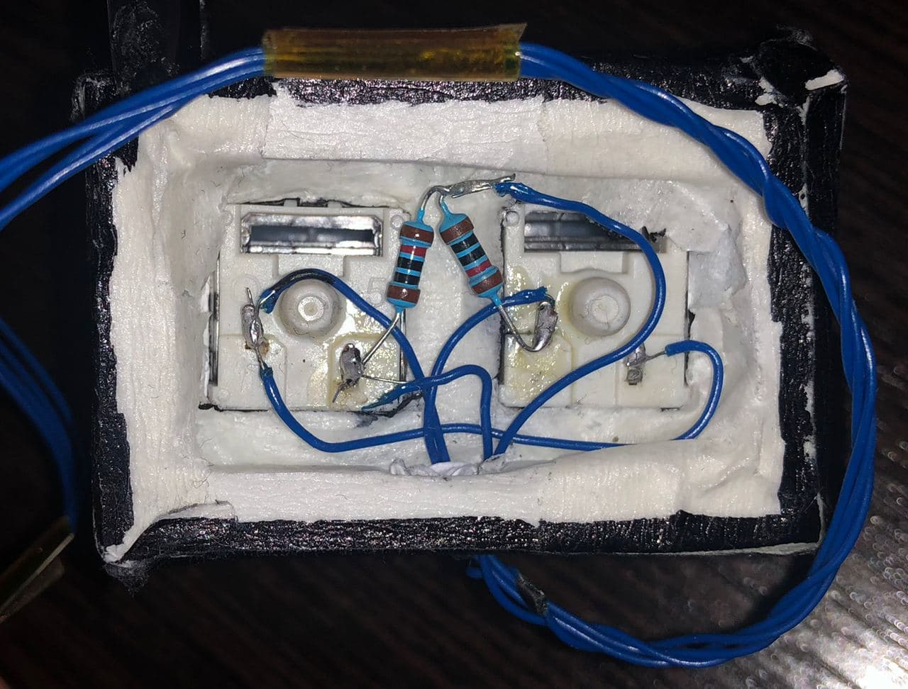
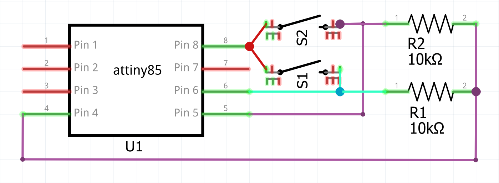
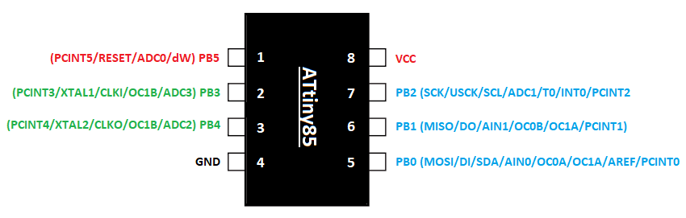
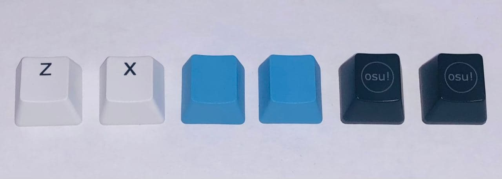

# OSU_Keyboard_v1
Small keyboard with two keys on the Arduino for 3 bucks

## Materials

------------------------------------ About Maker ---------------------------------

- Blog : [http://tahion.xyz](http://tahion.xyz)
- Youtube channel: [Click here](https://www.youtube.com/channel/UCu-OKHq4bUrGx2uvRN6EB4A)

------------------------------------ Parts ---------------------------------

- All the parts information : [https://](https://)

------------------------------------ Instruction --------------------------

- Youtube: [Click here](https://youtu.be/)
- Schematic [https://github.com/](https://github.com/)

---

# Instruction

## Preparing Materials

### 1. Buying some parts

- Digispark attiny85
- Foamed PVC / 3D printed case
- Wire
- 2 Switches / Or pull them out of the friend's keyboard

### 2. Preparing some tools

- Soldering iron
- Flux
- Solder

### 3. Assembling

1. Put a switch into upper case
    
    

2. Bend the legs of the switches and solder them to the wire
    
    

3. Solder wire to the Attiny85
    
    
    
    

5. Use your favorite keycaps

    

## Programming

Download and Install Arduino IDE / Board setting

    * Follow this instruction
    * [http://digistump.com/wiki/digispark/tutorials/connecting](http://digistump.com/wiki/digispark/tutorials/connecting)

|SKIP| 2. Download a library for USB keyboard, USB mouse, USB media control simultaneously

    * [https://learn.adafruit.com/trinket-usb-volume-knob/code](https://learn.adafruit.com/trinket-usb-volume-knob/code)

    > Because the library from Digispark is not enough to use. The main issue is we can’t send a keyboard signal and a mouse signal at the same time. Sending only keyboard or mouse signal is good enough for general situation. But sometimes, we need to use both keyboard and mouse together such as gaming situation.

    

|SKIP| 3. Unzip the file

|SKIP| 4. Copy “TrinketHidCombo” folder into your arduino library folder
    
    

5. Open your Arduino IDE, copy and paste here's code [OSU_Keyboard]
    
    * [https://github.com/Tah1on/osu_keyboard_v1](https://github.com/Tah1on/osu_keyboard_v1)

6. Upload the program to your board by following this order

    - Unplug the board
    - Click upload button of Arduino IDE
    - Wait until “Running Digispark Uploader … “ shows
    - Plug your board
    - Done.

    > Notice : In order to upload program to Attiny85 board, you don’t need to select any port. Unplug your board.

## Tweak it as your need
